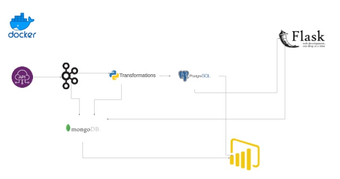

# Real Time Stock Prediction Pipeline + Dashboard

This project uses Docker Compose to set up a complete environment for Stock Prediction. It includes ZooKeeper, Kafka, producers, consumers, a Flask server, and a PostgreSQL database.

## Prerequisites

Before you begin, make sure you have the following prerequisites installed on your system:

- [Docker](https://www.docker.com/)
- [Docker Compose](https://docs.docker.com/compose/)

## Project Architecture



## Services

Here's a brief description of the services included in this project:

### ZooKeeper

ZooKeeper is used for distributed coordination and management. It plays a crucial role in maintaining configuration information, providing distributed synchronization, and more.

### Kafka

Kafka is a distributed streaming platform used for real-time data feeds. It serves as the central data pipeline for streaming data between producers and consumers.

### Producer

The producer service sends data to Kafka topics. It can be customized to generate and send data related to stock predictions to Kafka for processing.

### Consumer

The consumer service processes data from Kafka topics. It receives and analyzes data related to stock predictions, making it an essential component for real-time data processing.

### Flask Server

The Flask server provides an API for stock predictions. It serves as an interface for users and depends on Kafka for real-time data updates.

### PostgreSQL

PostgreSQL is used for storing historical stock data. It acts as a reliable and efficient database for managing and retrieving historical stock information.

## Usage

1. Clone this repository to your local machine:

   ```bash
   git clone https://github.com/your-username/stock-prediction-docker-compose.git
   cd stock-prediction-docker-compose
   
2. Create a .env file based on the provided .env.example file. Customize it with your configuration settings.
    - this is an exemble :
      ```bash
      MONGO_URI=
      KAFKA_HOST=
      FLASK_SERVER_HOST=

4. Build and start the Docker containers:
   ```bash
   docker-compose up -d

## MongoDB Atlas Error Logging

In this project, MongoDB Atlas is used for storing and visualizing error logs generated during the stock prediction process. MongoDB Atlas is a cloud-based MongoDB service that provides scalability, flexibility, and ease of use for data storage.

### Setting Up MongoDB Atlas

1. **Sign Up for MongoDB Atlas**:
   - If you don't already have an account, sign up for MongoDB Atlas at [https://www.mongodb.com/cloud/atlas](https://www.mongodb.com/cloud/atlas).

2. **Create a Cluster**:
   - Once logged in, create a new MongoDB Atlas cluster. Follow the instructions provided in the MongoDB Atlas dashboard to set up your cluster.

3. **Database and Collection**:
    - Create a MongoDB database and collection within your MongoDB Atlas cluster to store error logs. You can do this using the MongoDB Atlas dashboard.
4. **Add your Mongo URI to the .env file**
  

## Power BI Dashboard

This project includes a Power BI dashboard for visualizing stock prediction data. Follow these steps to view the dashboard:

1. Access the Power BI Service (https://powerbi.com) or install the Power BI Desktop application if you haven't already.

2. Sign in to your Power BI account or create one if you don't have an account.

3. Import the provided Power BI file (`Stock_Dashboard.pbix`) into your Power BI workspace.

4. Customize the dashboard and reports as needed.

5. Share the dashboard with team members or stakeholders using Power BI sharing options.

The Power BI dashboard provides interactive visualizations and insights based on the data generated by this project.

Please note that you need appropriate permissions and access to the Power BI workspace to view and modify the dashboard.


